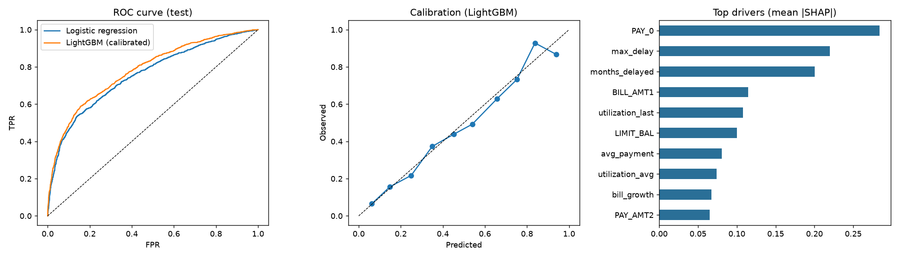

# Credit Risk Scoring — End-to-End ML System

[](https://github.com/Sudeepcpc/credit-risk-scoring/actions/workflows/ci.yml)   

Predicts the probability that a credit card customer **defaults next month**, explains every decision with SHAP reasons, and serves it as a production-style REST API.

**Built by Sudeep C P** · Data: [UCI Default of Credit Card Clients](https://archive.ics.uci.edu/dataset/350) (30,000 real customers, 22.1% default rate)

---

## Results (held-out test set, 6,000 customers)

| Model | ROC-AUC | Gini | KS | Brier ↓ | Recall | Cost / customer ↓ |
|---|---|---|---|---|---|---|
| Logistic regression (scorecard baseline) | 0.756 | 0.513 | 0.396 | 0.189 | 74.2% | 0.587 |
| **LightGBM, tuned + isotonic-calibrated** | **0.781** | **0.562** | **0.433** | **0.134** | **77.7%** | **0.555** |

- **Business impact:** with a 5:1 cost of missing a defaulter vs. wrongly flagging a good customer, the model **cuts expected credit loss cost by 49.9%** versus approving everyone.
- **Calibrated probabilities:** Brier score fell 29% vs. the baseline, so a score of 0.30 really means ~30% risk — essential for pricing and provisioning.
- **Fairness:** `SEX` is excluded from training (fair-lending practice) and kept only for audit. Flag-rate ratio female/male = **0.94** (above the 0.8 "four-fifths" rule); a unit test proves changing `SEX` never changes a score.
- **Stability:** max PSI train vs. test = 0.003 (stable).



## Architecture

```
data (UCI) ─► clean ─► feature engineering ─► CV model selection ─► calibration ─► cost-optimal threshold
                              │                                                          │
                              └────────── same code reused at serving ◄──── model.joblib ┘
                                                     │
                       FastAPI /predict  ─► probability + risk band + decision + top-3 SHAP reasons
                                                     │
                                  PSI drift monitoring vs. reference sample
```

## What makes this production-grade

| Concern | How it's handled |
|---|---|
| Data quality | Undocumented category codes (EDUCATION 0/5/6, MARRIAGE 0, PAY −2/−1) found in EDA and mapped in `data.clean` |
| Feature engineering | 10 analyst-style features: utilization, payment-to-bill ratios, delinquency count/max/trend, bill growth, zero-payment months |
| No leakage | Threshold tuned on **out-of-fold train predictions**, never on test; one pure `add_features` function shared by training and serving |
| Model selection | 5-fold stratified CV, randomized hyper-parameter search, baseline comparison |
| Business metric | Decision threshold minimizes expected cost, not accuracy |
| Explainability | Global SHAP importance + per-applicant "top reasons" in every API response (adverse-action style) |
| Fairness | Protected attribute excluded + audited |
| Monitoring | Population Stability Index per feature (`monitoring.py`): stable / watch / retrain |
| Serving | FastAPI, Pydantic input validation, single + batch endpoints, health check, OpenAPI docs |
| Quality | 11 pytest tests (features, metrics, drift, API, fairness invariance) |
| CI/CD | GitHub Actions: tests → retrain from source → **AUC quality gate ≥ 0.76** → API tests → Docker build |
| Packaging | Slim Docker image with healthcheck |

## Quick start

```bash
pip install -r requirements.txt
make train     # downloads data, trains, writes models/ and reports/ (~2 min)
make test      # 11 tests
make serve     # http://localhost:8000/docs
# or
make docker
```

### Example request

```bash
curl -X POST localhost:8000/predict -H "Content-Type: application/json" -d '{
  "LIMIT_BAL": 20000, "SEX": 2, "EDUCATION": 2, "MARRIAGE": 1, "AGE": 34,
  "PAY_0": 3, "PAY_2": 2, "PAY_3": 2, "PAY_4": 2, "PAY_5": 0, "PAY_6": 0,
  "BILL_AMT1": 19500, "BILL_AMT2": 19500, "BILL_AMT3": 19500, "BILL_AMT4": 19500, "BILL_AMT5": 19500, "BILL_AMT6": 19500,
  "PAY_AMT1": 0, "PAY_AMT2": 0, "PAY_AMT3": 0, "PAY_AMT4": 0, "PAY_AMT5": 0, "PAY_AMT6": 0 }'
```

```json
{ "default_probability": 0.7223, "risk_band": "high", "decision": "review", "model_version": "1.0.0",
  "top_reasons": [
    {"feature": "PAY_0", "value": 3.0, "impact": 1.0174, "direction": "raises risk"},
    {"feature": "months_delayed", "value": 4.0, "impact": 0.4331, "direction": "raises risk"},
    {"feature": "max_delay", "value": 3.0, "impact": 0.3875, "direction": "raises risk"} ] }
```

## Repo layout

```
src/credit_risk/   config · data · features · train · evaluate · predict · monitoring
api/main.py        FastAPI service
tests/             unit + API tests
models/            trained artefacts (model, SHAP booster, drift reference sample)
reports/           metrics.json, drift report, figures
.github/workflows/ CI pipeline
```

## Key findings

1. **Recent repayment status (`PAY_0`) dominates** — last month's delay is the single strongest signal; the engineered `max_delay` and `months_delayed` rank #2 and #3.
2. **Utilization matters more than raw bill size** — ratio features beat absolute amounts, matching credit-bureau practice.
3. Gradient boosting beats the linear scorecard by +0.025 AUC, and calibration fixes its over-confident raw probabilities.

## Next steps

- Out-of-time validation and a challenger model registry (MLflow)
- Scheduled drift job that opens a retrain PR when PSI > 0.25
- Deploy to Cloud Run / Render with autoscaling
